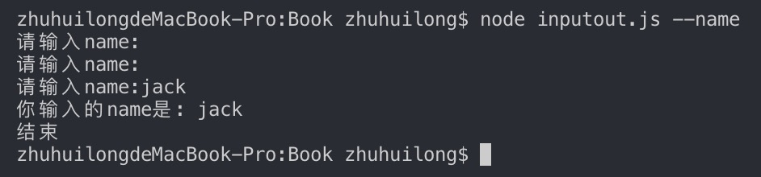
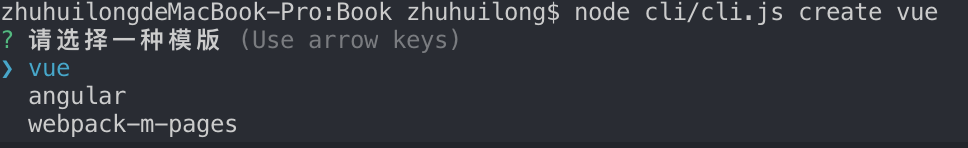
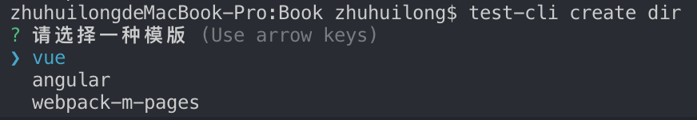

# node 命令行

## process （进程）
process对象是一个全局变量，它提供了当前node.js进程的信息并对其控制。因为其是一个全局变量所以无需在文件中引入。

**需要用到的几个api**

- process.argv
- process.cwd()
- process.stdin
- process.stdout
- process.stdin.resume()

### process.argv
process.argv属性返回一个数组。数组的第一个值是process.execPath,第二个是正在执行的JavaScript的文件路径，其余参数为其它命令参数，这是我们来自定义命令的关键。

#### 示例

**新建argv.js**

```js
//  argv.js
console.log(process.argv)

```

**执行node命令 node argv.js**

```shell
node argv.js --name zhu
## 输出
[ '/usr/local/bin/node', ## 执行当前脚本的Node二进制文件的绝对路径
  '/Users/zhuhuilong/Node/Book/argv.js', ## 文件的绝对路径
  '--name', ## 其余参数
  'zhu' ]
```

**接收自定义的命令参数进行处理输出**

```js
//  argv.js
console.log(process.argv)

let argvs = process.argv

let param = argvs.splice(2)
if(param[0] && param[0] == '--name'){
  if(param[1]){
    console.log(`hello ${param[1]}`)
  }else{
    console.log('请输入name')
  }
}
```

**>运行argv.js**

```shell
node argv.js --name zhu
## 输出
[ '/usr/local/bin/node',
  '/Users/zhuhuilong/Node/Book/argv.js',
  '--name',
  'zhu' ]
hello zhu
param [ '--name', 'zhu' ]
```

### process.stdin与process.stdout

**process.stdin**(标准输入)

process.stdin 属性返回连接到 stdin (fd 0) 的流。 它是一个 net.Socket 流（也就是双工流），除非 fd 0 指向一个文件，在这种情况下它是一个可读流。

**process.stdout**(标准输出)

process.stdout 属性返回连接到 stdout (fd 1) 的流。 它是一个 net.Socket 流（也就是双工流），除非 fd 1 指向一个文件，在这种情况下它是一个可写流。

### process.stdin.resume()
- 一个指向 标准输入流(stdin) 的可读流(Readable Stream)。标准输入流默认是暂停 (pause) 的，所以必须要调用 process.stdin.resume() 来恢复 (resume) 接收。

- 作为流，process.stdin可以在旧模式下使用。为了兼容node v0.10以前的版本。在旧模式喜爱使用stdin必须调用process.stdin.resume()。注意如果调用了process.stdin.resume() stdin将转为旧模式。

通俗来讲就是控制台等待我们输入内容不退出进程，对输入输出进行交互。

**新建inputout.js**

```js
// inputout.js
process.stdin.setEncoding('utf8')

let argvs = process.argv

let param = argvs.splice(2)
if (param[0] && param[0] == '--name') {
  if (param[1]) {
    console.log(`hello ${param[1]}`)
  } else {
    process.stdout.write(`请输入name:`)
    process.stdin.resume()
    process.stdin.on('data', chunk => {
      if (!!chunk.replace(/[\r\n]/g, '')) {
        process.stdout.write(`你输入的name是: ${chunk}`)
        process.stdin.emit('end')
      } else {
        process.stdout.write(`请输入name:`)
      }
    })
  }
}

process.stdin.on('end', () => {
  process.stdout.write('结束\n')
})

```

**>执行node inputout.js --name**



#### 备注
在新版本node模式下可以使用process.stdin.on("readable",()=>{})代替process.stdin.resume()恢复输入流接收。

示例：

```js
process.stdin.on("readable", () => {
  var chunk = process.stdin.read();
  console.log(typeof(chunk))
  if (chunk !==null) {
    process.stdout.write(`data: ${chunk}`);
    process.stdin.emit("end");
  }
});

process.stdin.on("end", () => {
  process.stdout.write("end");
});
```

从上面的示例我们可以拿到process.argv参数对其进行处理交互，但如果要实现更复杂的命令交互，使用上面的方法会很吃力。下面我们使用commander.js和inquirer来实现一个完整的node命令行工具(创建项目模版)。

## commander.js

node.js命令行界面的完整解决方案，受Ruby Commander启发。

### commander.js的API简述

**program.version() 声明版本**

```js
const program = require('commander')
const pkg = require('../package.json')
program.version(pkg.version)
```
**Options 解析**

使用.option()方法定义commander的选项options，也可以作为选项的文档。

```js
var program = require('commander');
 
program
  .version('0.1.0')
  .option('-p, --peppers', 'Add peppers')
  .option('-P, --pineapple', 'Add pineapple')
  .option('-b, --bbq-sauce', 'Add bbq sauce')
  .option('-c, --cheese [type]', 'Add the specified type of cheese [marble]', 'marble')
  .parse(process.argv);
 
console.log('you ordered a pizza with:');
if (program.peppers) console.log('  - peppers');
if (program.pineapple) console.log('  - pineapple');
if (program.bbqSauce) console.log('  - bbq');
console.log('  - %s cheese', program.cheese);
```

**添加自定义命令program.command()**

```js
var program = require('commander');
 
program
  .command('rm <dir>') //<>必选参数，如果是[]则是可选参数
  .option('-r, --recursive', 'Remove recursively')
  .action(function (dir, cmd) {
    console.log('remove ' + dir + (cmd.recursive ? ' recursively' : ''))
  })
 
program.parse(process.argv)

// command()可变参数
/** 命令command有且只有最后一个参数可变不固定的。 要使参数变量可变，必须将...附加到参数名称。**/
program
  .version('0.1.0')
  .command('rmdir <dir> [otherDirs...]')
  .action(function (dir, otherDirs) {
    console.log('rmdir %s', dir);
    if (otherDirs) {
      otherDirs.forEach(function (oDir) {
        console.log('rmdir %s', oDir);
      });
    }
  });
 
program.parse(process.argv);

```

**program.action() 定义命令的回调函数**

```js
var program = require("commander");

program
  .command("rm <dir>")
  .option("-r, --recursive", "Remove recursively")
  .option("-f, --force", "remove force")
  .action(function(dir, cmd) {
    // cmd为option参数选项
    //console.log('cmd',cmd)
    if (cmd.recursive) {
      console.log("remove " + dir + " recursively");
    }
    if (cmd.force) {
      console.log("remove " + dir + " forcefully");
    }
  });

program.parse(process.argv);
```

## inquirer.js
[Inquirer.js](https://www.npmjs.com/package/inquirer)使用NodeJs做的一个通用交互式命令行用户界面的集合。具有常用的控制台交互操作。


由于交互的问题种类不同，inquirer为每个问题提供很多参数：

- type：表示提问的类型，包括：input, confirm, list, rawlist, expand, checkbox, password, editor；
- name: 存储当前问题回答的变量；
- message：问题的描述；
- default：默认值；
- choices：列表选项，在某些type下可用，并且包含一个分隔符(separator)；
- validate：对用户的回答进行校验；
- filter：对用户的回答进行过滤处理，返回处理后的值；
- transformer：对用户回答的显示效果进行处理(如：修改回答的字体或背景颜色)，但不会影响最终的答案的内容；
- when：根据前面问题的回答，判断当前问题是否需要被回答；
- pageSize：修改某些type类型下的渲染行数；
- prefix：修改message默认前缀；
- suffix：修改message默认后缀。

### 创建cli.js

```js
const program = require('commander')
const inquirer = require('inquirer')
const fs = require('fs')
const path = require('path')
const pkg = require('../package.json')

const CWD = process.cwd()

const promptList = [
  {
    type: 'list',
    message: '请选择一种模版',
    name: 'template',
    choices: ['vue', 'angular', 'webpack-m-pages'],
    filter: function(val) {
      return val.toLowerCase()
    }
  }
]

program
  .version(pkg.version)
  .command('create <dir>')
  .description('create project template')
  .action(function(dir, cmd) {
    const TEMPLATE_PATH = path.join(CWD, dir)
    if (fs.existsSync(TEMPLATE_PATH)) {
    } else {
      fs.mkdirSync(TEMPLATE_PATH)
    }
    if (dir) {
      inquirer.prompt(promptList).then(anwsers => {
        console.log(anwsers)
      })
    }
  })

program.parse(process.argv)
```
运行 node cli/cli.js create vue


已经可以运行了，我们自定义一个命名替代每次都执行node

命令为：test-cli create <dir>

1、创建bin文件夹，在bin文件夹下创建index.js文件

```js
#!/usr/bin/env node

require('../cli/cli')
```

2、修改package.json文件
添加bin选项
```json
"bin": {
    "test-cli": "./bin/index.js"
  },
```

3、执行npm link (如果没有权限，执行sudo npm link)

4、测试


5、发布 npm publish (如果未登录需先 npm login登录)

6、发布完毕，需npm unlink解除本地的命令映射
npm install -g XXX


